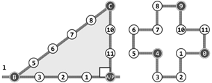
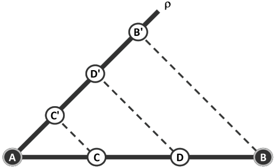

# 丛书序

“清华大学计算机系列教材”已经出版发行了30余种，包括计算机科学与技术专业的基础  数学、专业技术基础和专业等课程的教材，覆盖了计算机科学与技术专业本科生和研究生的主要教学内容。这是一批至今发行数量很大并赢得广大读者赞誉的书籍，是近年来出版的大学计算机专业教材中影响比较大的一批精品。

本系列教材的作者都是我熟悉的教授与同事，他们长期在第一线担任相关课程的教学工作， 是一批很受本科生和研究生欢迎的任课教师。编写高质量的计算机专业本科生（和研究生）教材， 不仅需要作者具备丰富的教学经验和科研实践，还需要对相关领域科技发展前沿的正确把握和了解。正因为本系列教材的作者们具备了这些条件，才有了这批高质量优秀教材的产生。可以说， 教材是他们长期辛勤工作的结晶。本系列教材出版发行以来，从其发行的数量、读者的反映、已经获得的国家级与省部级的奖励，以及在各个高等院校教学中所发挥的作用上，都可以看出本系列教材所产生的社会影响与效益。

计算机学科发展异常迅速，内容更新很快。作为教材，一方面要反映本领域基础性、普遍性的知识，保持内容的相对稳定性；另一方面，又需要跟踪科技的发展，及时地调整和更新内容。本系列教材都能按照自身的需要及时地做到这一点。如王爱英教授等编著的《计算机组成与结构》、戴梅萼教授等编著的《微型计算机技术及应用》都已经出版了第四版，严蔚敏教授的《数据结构》也出版了三版，使教材既保持了稳定性，又达到了先进性的要求。

本系列教材内容丰富，体系结构严谨，概念清晰，易学易懂，符合学生的认知规律，适合于教学与自学，深受广大读者的欢迎。系列教材中多数配有丰富的习题集、习题解答、上机及实验指导和电子教案，便于学生理论联系实际地学习相关课程。

随着我国进一步的开放，我们需要扩大国际交流，加强学习国外的先进经验。在大学教材建设上，我们也应该注意学习和引进国外的先进教材。但是，“清华大学计算机系列教材”的出版发行实践以及它所取得的效果告诉我们，在当前形势下，编写符合国情的具有自主版权的高质量教材仍具有重大意义和价值。它与国外原版教材不仅不矛盾，而且是相辅相成的。本系列教材的出版还表明，针对某一学科培养的要求，在教育部等上级部门的指导下，有计划地组织任课教师编写系列教材，还能促进对该学科科学、合理的教学体系和内容的研究。

我希望今后有更多、更好的我国优秀教材出版。

**清华大学计算机系教授中国科学院院士**

**张钹**

# 序

为适应快速发展的形势，计算机专业基础课的教学必须走内涵发展的道路，扎实的理论基础、计算思维能力和科学的方法论是支撑该学科从业人员进行理性思维和理性实践的重要基础。“程序设计基础”、“面向对象技术”、“离散数学”以及“数据结构”等相关课程，构成了清华大学计算机系专业基础课程体系中的一条重要脉络。近年来为强化学生在计算思维和实践能力方面的训练力度，课程组通过研究，探索和实践，着力对该课程系列的教学目标、内容、方法和各门课的分工，以及如何衔接等进行科学而系统的梳理，进一步明确了教学改革的方向。在这样的背景下，由邓俊辉撰写的《数据结构(C++语言版)》正式出版了。

为了体现教材的先进性，作者研读并参考了计算学科教学大纲(ACM/IEEEComputingCurricula)，结合该课程教学的国际发展趋势和对计算机人才培养的实际需求，对相关知识点做了精心取舍，从整体考虑加以编排，据难易程度对各章节内容重新分类，给出了具体的教学计划方案。

为了不失系统性，作者依据多年的教学积累，对各种数据结构及其算法，按照分层的思想精心进行归纳和整理，并从数据访问方式、数据逻辑结构、算法构成模式等多个角度，理出线索加以贯穿，使之构成一个整体，使学生在学习数据结构众多知识点的同时，获得对这门学问相关知识结构的系统性和全局性的认识。

计算机学科主张“抽象第一”，这没有错，但弄不好会吓倒或难倒学生。本书从具体实例入手,运用“转换-化简”、“对比-类比”等手法，借助大量插图和表格，图文并茂地展示数据结构组成及其算法运转的内在过程与规律，用形象思维帮助阐释抽象过程，给出几乎所有算法的具体实现，并通过多种版本做剖析和对比，引领读者通过学习提升抽象思维能力。

计算机学科实践性极强，不动手是学不会的。为了强化实践，本书除了每章都布置人人必做的习题和思考题外，还有不少于授课学时的上机编程要求，旨在培养学生理性思维和理性实践的动脑动手能力。

《中国计算机科学与技术学科教程2002》曾批评国内有关程序设计类的课，一是淡化算法，二是“一开始就扎进程序设计的语言细节中去”。本书十分重视从算法的高度来讲述数据结构与算法的相互依存关系，在书的开篇就用极其精彩的例子讲清了算法效率和算法复杂度度量的基本概念和方法，这就给全书紧密结合算法来讲数据结构打下了很好的基础。

这本书是精心策划和撰写的，结构严整，脉络清晰，行文流畅，可读性强。全书教学目标明确，内容丰富，基本概念和基本方法的阐述深入浅出，最大的特点是将算法知识、数据结构和编程实践有机地融为一体。我以为，引导学生学好本书，对于奠定扎实的学科基础，提高计算思维能力能够起到良好的作用。

**清华大学计算机系教授**

**吴文虎**

**2011年9月**

# 1. 绪论

作为万物之灵的人，与动物的根本区别在于理性，而计算则是理性的一种重要而具体的表现形式。计算机是人类从事计算的工具，是抽象计算模型的具体物化。基于图灵模型的现代计算机， 既是人类现代文明的标志与基础，更是人脑思维的拓展与延伸。

尽管计算机的性能日益提高，但这种能力在解决实际应用问题时能否真正得以发挥，决定性的关键因素仍在于人类自身。具体地，通过深入思考与分析获得对问题本质的透彻理解，按照长期积淀而成的框架与模式设计出合乎问题内在规律的算法，选用、改进或定制足以支撑算法高效实现的数据结构，并在真实的应用环境中充分测试、调校和改进，构成了应用计算机高效求解实际问题的典型流程与不二法门。任何一位有志于驾驭计算机的学生，都应该从这些方面入手，不断学习，反复练习，勤于总结。

本章将介绍与计算相关的基本概念，包括算法构成的基本要素、算法效率的衡量尺度、计算复杂度的分析方法与界定技巧、算法设计的基本框架与典型模式，这些也构成了全书所讨论的各类数据结构及相关算法的基础与出发点。

## 1.1 计算机与算法

1946年问世的ENIAC开启了现代电子数字计算机的时代，计算机科学（computer science）也在随后应运而生。计算机科学的核心在于研究计算方法与过程的规律，而不仅仅是作为计算工具的计算机本身，因此 E.Dijkstra 及其追随者更倾向于将这门科学称作计算科学（computing science）。

实际上，人类使用不同工具从事计算的历史可以追溯到更为久远的时代，计算以及计算工具始终与我们如影相随地穿越漫长的时光岁月，不断推动人类及人类社会的进化发展。从最初颜色各异的贝壳、长短不一的刻痕、周载轮回的日影、粗细有别的绳结，以至后来的直尺、圆规和算盘，都曾经甚至依然是人类有力的计算工具。

### 1.1.1 古埃及人的绳索

 古埃及人以其复杂而浩大的建   筑工程而著称于世，在长期规划与实施此类工程的过程中，他们逐渐归纳并掌握了基本的几何度量和测绘方法。考古研究发现，公元前2000年的古埃及人已经知道如何解决如下实际工程问题：通过直线l上给定的点P，作该直线的垂线。   

> 
>
> **图1.1 古埃及人使用的绳索计算机及其算法**

他们所采用的方法，原理及过程如图1.1所示，翻译成现代的算法语言可描述如下。

> perpendicular(l, P)
>
> 输入：直线l及其上一点P
>
> 输出：经过P且垂直于l的直线
>
> 1. 取12段等长绳索，依次首尾联结成环 //联结处称作“结”，按顺时针方向编号为0..11
> 2. 奴隶A看管0号结，将其固定于点P处
> 3. 奴隶B牵动4号结，将绳索沿直线l方向尽可能地拉直
> 4. 奴隶C牵动9号结，将绳索尽可能地拉直
> 5. 经过0号和9号结，绘制一条直线
>
> **算法1.1 过直线上给定点作直角**

以上由古希腊人发明、由奴隶与绳索组成的这套计算工具，乍看起来与现代的电子计算机相去甚远。但就本质而言，二者之间的相似之处远多于差异，它们同样都是用于支持和实现计算过程的物理机制，亦即广义的计算机。因此就这一意义而言，将其称作“绳索计算机”毫不过分。

### 1.1.2 欧几里得的尺规

欧几里得几何是现代公理系统的鼻祖。从计算的角度来看，针对不同的几何问题，欧氏几何都分别给出了一套几何作图流程，也就是具体的算法。比如，经典的线段三等分过程可描述为如算法1.2所示。该算法的一个典型的执行实例如图1.2所示。

> tripartition(AB)
>
> 输入：线段AB
>
> 输出：将AB三等分癿两个点C和D
>
> 1. 从A发出一条不AB不重合的射线
> 2. 任取𝝆上三点C'、D'和B'，使|AC'| = |C'D'| = |D'B'| 
> 3. 联接B'B
> 4. 过D'做B'B的平行线，交AB于D
> 5. 过C'做B'B的平行线，交AB于C
>
> **算法1.2 三等分给定线段**

> 
>
> **图1.2 古希腊人的尺规计算机.png**

在以上算法中，输入为所给的直线段AB，输出为将其三等分的C和D点。我们知道，欧氏几何还给出了大量过程与功能更为复杂的几何作图算法，为将这些算法变成可行的实际操作序列，欧氏几何使用了两种相互配合的基本工具：不带刻度的直尺，以及半径跨度不受限制的圆规。同样地，从计算的角度来看，由直尺和圆规构成的这一物理机制也不妨可以称作“尺规计算机”。在尺规计算机中，可行的基本操作不外乎以下五类：

> * 过两个点作一直线
> * 确定两条直线的交点
> * 以任一点为囿心，以任意半径作一个圆
> * 确定任一直线和任一圆的交点（若二者的确相交）
> * 确定两个圆的交点（若二者的确相交）

每一欧氏作图算法均可分解为一系列上述操作的组合，故称之为基本操作恰如其分。

### 1.1.3 起泡排序

D. Knuth[3]曾指出，四分之一以上的CPU时间都用于执行同一类型的计算：按照某种约定的次序，将给定的一组元素顺序排列，比如将n个整数按通常的大小次序排成一个非降序列。这类操作统称排序(sorting)。

就广义而言，我们今天借助计算机所完成的计算任务中，有更高的比例都可归入此类。例如， 从浩如烟海的万维网中找出与特定关键词最相关的前100个页面，就是此类计算的一种典型形式。 排序问题在算法设计与分析中扮演着重要的角色，以下不妨首先就此做一讨论。为简化起见，这 里暂且只讨论对整数的排序。