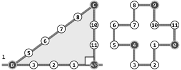

# 丛书序

“清华大学计算机系列教材”已经出版发行了30余种，包括计算机科学与技术专业的基础  数学、专业技术基础和专业等课程的教材，覆盖了计算机科学与技术专业本科生和研究生的主要教学内容。这是一批至今发行数量很大并赢得广大读者赞誉的书籍，是近年来出版的大学计算机专业教材中影响比较大的一批精品。

本系列教材的作者都是我熟悉的教授与同事，他们长期在第一线担任相关课程的教学工作， 是一批很受本科生和研究生欢迎的任课教师。编写高质量的计算机专业本科生（和研究生）教材， 不仅需要作者具备丰富的教学经验和科研实践，还需要对相关领域科技发展前沿的正确把握和了解。正因为本系列教材的作者们具备了这些条件，才有了这批高质量优秀教材的产生。可以说， 教材是他们长期辛勤工作的结晶。本系列教材出版发行以来，从其发行的数量、读者的反映、已经获得的国家级与省部级的奖励，以及在各个高等院校教学中所发挥的作用上，都可以看出本系列教材所产生的社会影响与效益。

计算机学科发展异常迅速，内容更新很快。作为教材，一方面要反映本领域基础性、普遍性的知识，保持内容的相对稳定性；另一方面，又需要跟踪科技的发展，及时地调整和更新内容。本系列教材都能按照自身的需要及时地做到这一点。如王爱英教授等编著的《计算机组成与结构》、戴梅萼教授等编著的《微型计算机技术及应用》都已经出版了第四版，严蔚敏教授的《数据结构》也出版了三版，使教材既保持了稳定性，又达到了先进性的要求。

本系列教材内容丰富，体系结构严谨，概念清晰，易学易懂，符合学生的认知规律，适合于教学与自学，深受广大读者的欢迎。系列教材中多数配有丰富的习题集、习题解答、上机及实验指导和电子教案，便于学生理论联系实际地学习相关课程。

随着我国进一步的开放，我们需要扩大国际交流，加强学习国外的先进经验。在大学教材建设上，我们也应该注意学习和引进国外的先进教材。但是，“清华大学计算机系列教材”的出版发行实践以及它所取得的效果告诉我们，在当前形势下，编写符合国情的具有自主版权的高质量教材仍具有重大意义和价值。它与国外原版教材不仅不矛盾，而且是相辅相成的。本系列教材的出版还表明，针对某一学科培养的要求，在教育部等上级部门的指导下，有计划地组织任课教师编写系列教材，还能促进对该学科科学、合理的教学体系和内容的研究。

我希望今后有更多、更好的我国优秀教材出版。

**清华大学计算机系教授中国科学院院士**

**张钹**

# 1. 绪论

作为万物之灵的人，与动物的根本区别在于理性，而计算则是理性的一种重要而具体的表现形式。计算机是人类从事计算的工具，是抽象计算模型的具体物化。基于图灵模型的现代计算机， 既是人类现代文明的标志与基础，更是人脑思维的拓展与延伸。

尽管计算机的性能日益提高，但这种能力在解决实际应用问题时能否真正得以发挥，决定性的关键因素仍在于人类自身。具体地，通过深入思考与分析获得对问题本质的透彻理解，按照长期积淀而成的框架与模式设计出合乎问题内在规律的算法，选用、改进或定制足以支撑算法高效实现的数据结构，并在真实的应用环境中充分测试、调校和改进，构成了应用计算机高效求解实际问题的典型流程与不二法门。任何一位有志于驾驭计算机的学生，都应该从这些方面入手，不断学习，反复练习，勤于总结。

本章将介绍与计算相关的基本概念，包括算法构成的基本要素、算法效率的衡量尺度、计算复杂度的分析方法与界定技巧、算法设计的基本框架与典型模式，这些也构成了全书所讨论的各类数据结构及相关算法的基础与出发点。

## 1.1 计算机与算法

1946年问世的ENIAC开启了现代电子数字计算机的时代，计算机科学（computer science）也在随后应运而生。计算机科学的核心在于研究计算方法与过程的规律，而不仅仅是作为计算工具的计算机本身，因此 E.Dijkstra 及其追随者更倾向于将这门科学称作计算科学（computing science）。

实际上，人类使用不同工具从事计算的历史可以追溯到更为久远的时代，计算以及计算工具始终与我们如影相随地穿越漫长的时光岁月，不断推动人类及人类社会的进化发展。从最初颜色各异的贝壳、长短不一的刻痕、周载轮回的日影、粗细有别的绳结，以至后来的直尺、圆规和算盘，都曾经甚至依然是人类有力的计算工具。

### 1.1.1 古埃及人的绳索

 古埃及人以其复杂而浩大的建   筑工程而著称于世，在长期规划与实施此类工程的过程中，他们逐渐归纳并掌握了基本的几何度量和测绘方法。考古研究发现，公元前2000年的古埃及人已经知道如何解决如下实际工程问题：通过直线l上给定的点P，作该直线的垂线。   

他们所采用的方法，原理及过程如图1.1所示，翻译成现代的算法语言可描述如下。

> perpendicular(l, P)
>输入：直线l及其上一点P
> 输出：经过P且垂直于l的直线
>
> 1. 取12段等长绳索，依次首尾联结成环 //联结处称作“结”，按顸时针斱向编号为0..11
>2. 奴隶A看管0号结，将其固定于点P处
> 3. 奴隶B牵动4号结，将绳索沿直线l方向尽可能地拉直
>4. 奴隶C牵动9号结，将绳索尽可能地拉直
> 5. 经过0号和9号结，绘制一条直线

