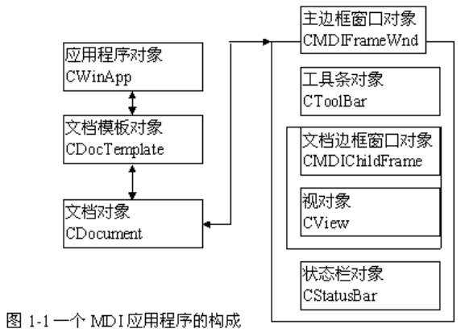

[TOC]

# 作者序

我曾写一本关于MFC的书，分析了MFC的结构和设计(《MFC深入浅出》)，华中理工大学出版。书的内容建立在对MSDN和MFC SOURCE CODE的大量分析上，该书对于希望学习MFC的人来说，是较有价值的。可惜出版社好象只在几个城市针对学生作销售，虽然学生反应不错，但是外界知道不多。 

# MFC概述

## MFC是一个编程框架

MFC (Microsoft Foundation Class  Library)中的各种类结合起来构成了一个应用程序框架，它的目的就是让程序员在此基础上来建立Windows下的应用程序，这是一种相对SDK来说更为简单的方法。因为总体上，MFC框架定义了应用程序的轮廓，并提供了用户接口的标准实现方法，程序员所要做的就是通过预定义的接口把具体应用程序特有的东西填入这个轮廓。Microsoft  Visual  C++提供了相应的工具来完成这个工作：**AppWizard**可以用来生成初步的框架文件（代码和资源等）；资源编辑器用于帮助直观地设计用户接口；**ClassWizard**用来协助添加代码到框架文件；最后，编译，则通过类库实现了应用程序特定的逻辑。 

### 封装

构成MFC框架的是MFC类库。MFC类库是C++类库。这些类或者封装了Win32应用程序编程接口，或者封装了应用程序的概念，或者封装了OLE特性，或者封装了ODBC和DAO数据访问的功能，等等，分述如下。

**（1）对Win32应用程序编程接口的封装**

用一个C++ Object来包装一个Windows Object。例如：`class CWnd`是一个C++ window  object，它把Windows window(HWND)和Windows window有关的API函数封装在C++ window  object的成员函数内，后者的成员变量`m_hWnd`就是前者的窗口句柄。

**（2）对应用程序概念的封装**

使用SDK编写Windows应用程序时，总要定义窗口过程，登记Windows  Class，创建窗口，等等。MFC把许多类似的处理封装起来，替程序员完成这些工作。另外，MFC提出了以**文档-视图**为中心的编程模式，MFC类库封装了对它的支持。文档是用户操作的数据对象，视图是数据操作的窗口，用户通过它处理、查看数据。

**（3）对COM/OLE特性的封装**

OLE建立在COM模型之上，由于支持OLE的应用程序必须实现一系列的接口（Interface），因而相当繁琐。MFC的OLE类封装了OLE  API大量的复杂工作，这些类提供了实现OLE的更高级接口。

**（4）对ODBC功能的封装**

以少量的能提供与ODBC之间更高级接口的C++类，封装了ODBC API的大量的复杂的工作，提供了一种数据库编程模式。

### 继承

首先，MFC抽象出众多类的共同特性，设计出一些基类作为实现其他类的基础。这些类中，最重要的类是`CObject`和`CCmdTarget`。`CObject`是MFC的根类，绝大多数MFC类是其派生的，包括``CCmdTarget``。`CObject`  实现了一些重要的特性，包括动态类信息、动态创建、对象序列化、对程序调试的支持，等等。所有从`CObject`派生的类都将具备或者可以具备`CObject`所拥有的特性。`CCmdTarget`通过封装一些属性和方法，提供了消息处理的架构。MFC中，任何可以处理消息的类都从`CCmdTarget`派生。

针对每种不同的对象，MFC都设计了一组类对这些对象进行封装，每一组类都有一个基类，从基类派生出众多更具体的类。这些对象包括以下种类：窗口对象，基类是`CWnd`；应用程序对象，基类是`CwinThread`；文档对象，基类是`Cdocument`，等等。

程序员将结合自己的实际，从适当的MFC类中派生出自己的类，实现特定的功能，达到自己的编程目的。

### 虚拟函数和动态约束

MFC以“C++”为基础，自然支持虚拟函数和动态约束。但是作为一个编程框架，有一个问题必须解决：如果仅仅通过虚拟函数来支持动态约束，必然导致虚拟函数表过于臃肿，消耗内存，效率低下。例如，`CWnd`封装  Windows窗口对象时，每一条Windows消息对应一个成员函数，这些成员函数为派生类所继承。如果这些函数都设计成虚拟函数，由于数量太多，实现起来不现实。于是，MFC建立了消息映射机制，以一种富有效率、便于使用的手段解决消息处理函数的动态约束问题。

这样，通过虚拟函数和消息映射，MFC类提供了丰富的编程接口。程序员继承基类的同时，把自己实现的虚拟函数和消息处理函数嵌入MFC的编程框架。MFC编程框架将在适当的时候、适当的地方来调用程序的代码。本书将充分的展示MFC调用虚拟函数和消息处理函数的内幕，让读者对MFC的编程接口有清晰的理解。

### MFC的宏观框架体系

如前所述，MFC实现了对应用程序概念的封装，把类、类的继承、动态约束、类的关系和相互作用等封装起来。这样封装的结果对程序员来说，是一套开发模板（或者说模式）。针对不同的应用和目的，程序员采用不同的模板。例如，SDI应用程序的模板，MDI应用程序的模板，规则DLL应用程序的模板，扩展DLL应用程序的模板，OLE/ACTIVEX应用程序的模板，等等。

这些模板都采用了以文档-视为中心的思想，每一个模板都包含一组特定的类。典型的MDI应用程序的构成将在下一节具体讨论。

为了支持对应用程序概念的封装，MFC内部必须作大量的工作。例如，为了实现消息映射机制，MFC编程框架必须要保证首先得到消息，然后按既定的方法进行处理。又如，为了实现对DLL编程的支持和多线程编程的支持，MFC内部使用了特别的处理方法，使用模块状态、线程状态等来管理一些重要信息。虽然，这些内部处理对程序员来说是透明的，但是，懂得和理解MFC内部机制有助于写出功能灵活而强大的程序。

总之，MFC封装了Win32 API，OLE API，ODBC  API等底层函数的功能，并提供更高一层的接口，简化了Windows编程。同时，MFC支持对底层API的直接调用。

MFC提供了一个Windows应用程序开发模式，对程序的控制主要是由MFC框架完成的，而且MFC也完成了大部分的功能，预定义或实现了许多事件和消息处理，等等。框架或者由其本身处理事件，不依赖程序员的代码；或者调用程序员的代码来处理应用程序特定的事件。

MFC是C++类库，程序员就是通过使用、继承和扩展适当的类来实现特定的目的。例如，继承时，应用程序特定的事件由程序员的派生类来处理，不感兴趣的由基类处理。实现这种功能的基础是C++对继承的支持，对虚拟函数的支持，以及MFC实现的消息映射机制。

## MDI应用程序的构成

本节解释一个典型的MDI应用程序的构成。

用AppWizard产生一个MDI工程t（无OLE等支持），AppWizard创建了一系列文件，构成了一个应用程序框架。这些文件分四类：头文件（`.h`），实现文件(`.cpp`)，资源文件(`.rc`)，模块定义文件(`.def`)，等。

### 构成应用程序的对象

图1-1解释了该应用程序的结构，箭头表示信息流向。

从`CWinApp`、`CDocument`、`CView`、`CMDIFrameWnd`、`CMDIChildWnd`类对应地派生出`CTApp`、`CTDoc`、`CTView`、`CMainFrame`、`CChildFrame`五个类，这五个类的实例分别是应用程序对象、文档对象、视对象、主框架窗口对象和文档边框窗口对象。主框架窗口包含了视窗口、工具条和状态栏。对这些类或者对象解释如下。

**（1）应用程序**

应用程序类派生于`CWinApp`。基于框架的应用程序必须有且只有一个应用程序对象，它负责应用程序的初始化、运行和结束。

**（2）边框窗口**

如果是SDI应用程序，从`CFrameWnd`类派生边框窗口类，边框窗口的客户子窗口(`MDIClient`)直接包含视窗口；如果是MDI应用程序，从`CMDIFrameWnd`类派生边框窗口类，边框窗口的客户子窗口(`MDIClient`)直接包含文档边框窗口。

如果要支持工具条、状态栏，则派生的边框窗口类还要添加`CToolBar`和`CStatusBar`类型的成员变量，以及在一个`OnCreate`消息处理函数中初始化这两个控制窗口。

边框窗口用来管理文档边框窗口、视窗口、工具条、菜单、加速键等，协调半模式状态（如上下文的帮助(SHIFT+F1模式)和打印预览）。

**（3）文档边框窗口**

文档边框窗口类从`CMDIChildWnd`类派生，MDI应用程序使用文档边框窗口来包含视窗口。

**（4）文档**

文档类从`CDocument`类派生，用来管理数据，数据的变化、存取都是通过文档实现的。视窗口通过文档对象来访问和更新数据。

**（5）视**

视类从`CView`或它的派生类派生。视和文档联系在一起，在文档和用户之间起中介作用，即视在屏幕上显示文档的内容，并把用户输入转换成对文档的操作。

**（6）文档模板**

文档模板类一般不需要派生。MDI应用程序使用多文档模板类`CMultiDocTemplate`；SDI应用程序使用单文档模板类`CSingleDocTemplate`。

应用程序通过文档模板类对象来管理上述对象（应用程序对象、文档对象、主边框窗口对象、文档边框窗口对象、视对象）的创建。

## 构成应用程序的对象之间的关系

这里，用图的形式可直观地表示所涉及的MFC类的继承或者派生关系，如图1-2所示意。

图1-2所示的类都是从`CObject`类派生出来的；所有处理消息的类都是从`CCmdTarget`类派生的。如果是多文档应用程序，文档模板使用`CMultiDocTemplae`，主框架窗口从`CMdiFarmeWnd`派生，它包含工具条、状态栏和文档框架窗口。文档框架窗口从`CMdiChildWnd`派生，文档框架窗口包含视，视从`CView`或其派生类派生。

## 构成应用程序的文件

通过上述分析，可知AppWizard产生的MDI框架程序的内容，所定义和实现的类。下面，从文件的角度来考察AppWizard生成了哪些源码文件，这些文件的作用是什么。表1-1列出了AppWizard所生成的头文件，表1-2列出了了AppWizard所生成的实现文件及其对头文件的包含关系。 

**表1-1 AppWizard所生成的头文件**

| `头文件`     | `用途`                                                       |
| ------------ | ------------------------------------------------------------ |
| `stdafx.h`   | 标准AFX头文件                                                |
| `resource.h` | 定义了各种资源ID                                             |
| `t.h`        | `#include "resource.h"` 定义了从`CWinApp`派生的应用程序对象`CTApp` |
| `childfrm.h` | 定义了从`CMDIChildWnd`派生的文档框架窗口对象`CTChildFrame`   |
| `mainfrm.h`  | 定义了从`CMDIFrameWnd`派生的框架窗口对象`CMainFrame`         |
| `tdoc.h`     | 定义了从`CDocument`派生的文档对象`CTDoc`                     |
| `tview.h`    | 定义了从`CView`派生的视图对象`CTView`                        |

**表1-2 AppWizard所生成的实现文件**

| 实现文件       | 所包含的头文件                                               | 实现的内容和功能                                         |
| -------------- | ------------------------------------------------------------ | -------------------------------------------------------- |
| `stdafx.cpp`   | `#include "stdafx.h"`                                        | 用来产生预编译的类型信息。                               |
| `t.cpp`        | `# include "stdafx.h"`  `# include "t.h"`   `# include "MainFrm.h"`  `# include "childfrm.h"`  `#include "tdoc.h"`  `#include "tview.h"` | 定义`CTApp`的实现，并定义`CTApp`类型的全局变量`theApp`。 |
| `childfrm.cpp` | `#inlcude "stdafx.h"`  `#include "t.h"`   `#include “childfrm.h”` | 实现了类`CChildFrame`                                    |
| `childfrm.cpp` | `#inlcude "stdafx.h"`  `#include "t.h"`   `#include "childfrm.h"` | 实现了类`CMainFrame`                                     |
| `tdoc.cpp`     | `# include "stdafx.h"`  `# include "t.h"`   `# include "tdoc.h"` | 实现了类`CTDoc`                                          |
| `tview.cpp`    | `# include "stdafx.h"`  `# include "t.h"`   `# include "tdoc.h" ` `# include "tview.h"` | 实现了类`CTview`                                         |

从表1-2中的包含关系一栏可以看出：

`CTApp` 的实现用到所有的用户定义对象，包含了他们的定义；`CView`  的实现用到`CTdoc`；其他对象的实现只涉及自己的定义；

当然，如果增加其他操作，引用其他对象，则要包含相应的类的定义文件。

对预编译头文件说明如下：

所谓头文件预编译，就是把一个工程(Project)中使用的一些MFC标准头文件(如`Windows.H`、`Afxwin.H`)预先编译，以后该工程编译时，不再编译这部分头文件，仅仅使用预编译的结果。这样可以加快编译速度，节省时间。

预编译头文件通过编译stdafx.cpp生成，以工程名命名，由于预编译的头文件的后缀是“`pch`”，所以编译结果文件是`projectname.pch`。

编译器通过一个头文件stdafx.h来使用预编译头文件。stdafx.h这个头文件名是可以在project的编译设置里指定的。编译器认为，所有在指令#include  "stdafx.h"前的代码都是预编译的，它跳过#include "stdafx.  h"指令，使用projectname.pch编译这条指令之后的所有代码。

因此，所有的CPP实现文件第一条语句都是：#include "stdafx.h"。

另外，每一个实现文件CPP都包含了如下语句：

\#ifdef _DEBUG

\#undef THIS_FILE

static char BASED_CODE THIS_FILE[] = __FILE__;

\#endif

这是表示，如果生成调试版本，要指示当前文件的名称。__FILE__是一个宏，在编译器编译过程中给它赋值为当前正在编译的文件名称。

# 内存分配方式和调试机制

## 内存分配

### 内存分配函数

MFCWin32或者C语言的内存分配API，有四种内存分配API可供使用。

2. Win32的堆分配函数  

   每一个进程都可以使用堆分配函数创建一个私有的堆──调用进程地址空间的一个或者多个页面。DLL创建的私有堆必定在调用DLL的进程的地址空间内，只能被调用进程访问。

   HeapCreate用来创建堆；HeapAlloc用来从堆中分配一定数量的空间，HeapAlloc分配的内存是不能移动的；HeapSize可以确定从堆中分配的空间的大小；HeapFree用来释放从堆中分配的空间；HeapDestroy销毁创建的堆。

3. Windows传统的全局或者局部内存分配函数  

   

   由于Win32采用平面内存结构模式，Win32下的全局和局部内存函数除了名字不同外，其他完全相同。任一函数都可以用来分配任意大小的内存（仅仅受可用物理内存的限制）。用法可以和Win16下基本一样。

   Win32下保留这类函数保证了和Win16的兼容。

   

4. C语言的标准内存分配函数  

   

   C语言的标准内存分配函数包括以下函数：

   malloc，calloc，realloc，free，等。

   这些函数最后都映射成堆API函数，所以，malloc分配的内存是不能移动的。这些函数的调式版本为

   malloc_dbg，calloc_dbg，realloc_dbg，free_dbg，等。

   

5. Win32的虚拟内存分配函数  

   

虚拟内存API是其他API的基础。虚拟内存API以页为最小分配单位，X86上页长度为4KB，可以用GetSystemInfo函数提取页长度。虚拟内存分配函数包括以下函数：

-  

- LPVOID VirtualAlloc(LPVOID lpvAddress,  

  

DWORD cbSize,

DWORD fdwAllocationType,

DWORD fdwProtect);

该函数用来分配一定范围的虚拟页。参数1指定起始地址；参数2指定分配内存的长度；参数3指定分配方式，取值MEM_COMMINT或者MEM_RESERVE；参数4指定控制访问本次分配的内存的标识，取值为PAGE_READONLY、PAGE_READWRITE或者PAGE_NOACCESS。

-  

- LPVOID VirtualAllocEx(HANDLE process,  

  

LPVOID lpvAddress,

DWORD cbSize,

DWORD fdwAllocationType,

DWORD fdwProtect);

该函数功能类似于VirtualAlloc，但是允许指定进程process。VirtaulFree、VirtualProtect、VirtualQuery都有对应的扩展函数。

-  

- BOOL VirtualFree(LPVOID lpvAddress,  

  

DWORD dwSize,

DWORD dwFreeType);

该函数用来回收或者释放分配的虚拟内存。参数1指定希望回收或者释放内存的基地址；如果是回收，参数2可以指向虚拟地址范围内的任何地方，如果是释放，参数2必须是VirtualAlloc返回的地址；参数3指定是否释放或者回收内存，取值为MEM_DECOMMINT或者MEM_RELEASE。

-  

- BOOL VirtualProtect(LPVOID lpvAddress,  

  

DWORD cbSize,

DWORD fdwNewProtect,

PDWORD pfdwOldProtect);

该函数用来把已经分配的页改变成保护页。参数1指定分配页的基地址；参数2指定保护页的长度；参数3指定页的保护属性，取值PAGE_READ、PAGE_WRITE、PAGE_READWRITE等等；参数4用来返回原来的保护属性。

-  

- DWORD VirtualQuery(LPCVOID lpAddress,  

  

PMEMORY_BASIC_INFORMATION lpBuffer,

DWORD dwLength

);

该函数用来查询内存中指定页的特性。参数1指向希望查询的虚拟地址；参数2是指向内存基本信息结构的指针；参数3指定查询的长度。

-  

- BOOL VirtualLock(LPVOID lpAddress,DWORD dwSize);  

  

该函数用来锁定内存，锁定的内存页不能交换到页文件。参数1指定要锁定内存的起始地址；参数2指定锁定的长度。

-  

- BOOL VirtualUnLock(LPVOID lpAddress,DWORD dwSize);  

  

参数1指定要解锁的内存的起始地址；参数2指定要解锁的内存的长度。

1. 1. 1.  

      2. 

         

         

         

         C++的new 和 delete操作符

         

MFC定义了两种作用范围的new和delete操作符。对于new，不论哪种，参数1类型必须是size_t，且返回void类型指针。

1.  

2. 全局范围内的new和delete操作符  

   

   原型如下：

   void _cdecl ::operator new(size_t nSize);

   void __cdecl operator delete(void* p);

   调试版本：

   void* __cdecl operator new(size_t nSize, int nType, 

   LPCSTR lpszFileName, int nLine)

   

3. 类定义的new和delete操作符  

   

原型如下：

void* PASCAL classname::operator new(size_t nSize);

void PASCAL classname::operator delete(void* p);

类的operator new操作符是类的静态成员函数，对该类的对象来说将覆盖全局的operator  new。全局的operator new用来给内部类型对象（如int）、没有定义operator new操作符的类的对象分配内存。

new操作符被映射成malloc或者malloc_dbg，delete被映射成free或者free_dbg。

1. 1.  

   2. 

      

      

      

      调试手段

      

      MFC应用程序可以使用C运行库的调试手段，也可以使用MFC提供的调试手段。两种调试手段分别论述如下。

      1.  

      2. 

         

         

         

         C运行库提供和支持的调试功能

         

C运行库提供和支持的调试功能如下：

1.  

2. 调试信息报告函数  

   

   用来报告应用程序的调试版本运行时的警告和出错信息。包括：

   _CrtDbgReport 用来报告调试信息；

   _CrtSetReportMode 设置是否警告、出错或者断言信息；

   _CrtSetReportFile 设置是否把调试信息写入到一个文件。

   

3. 条件验证或者断言宏：  

   

   断言宏主要有：

   assert 检验某个条件是否满足，不满足终止程序执行。

   验证函数主要有：

   _CrtIsValidHeapPointer 验证某个指针是否在本地堆中；

   _CrtIsValidPointer 验证指定范围的内存是否可以读写；

   _CrtIsMemoryBlock 验证某个内存块是否在本地堆中。

   

4. 内存（堆）调试：  

   

malloc_dbg  分配内存时保存有关内存分配的信息，如在什么文件、哪一行分配的内存等。有一系列用来提供内存诊断的函数：

**_**CrtMemCheckpoint 保存内存快照在一个_CrtMemState结构中；

_CrtMemDifference 比较两个_CrtMemState；

_CrtMemDumpStatistics 转储输出一_CrtMemState结构的内容；

_CrtMemDumpAllObjectsSince 输出上次快照或程序开始执行以来在堆中分配的所有对象的信息；

_CrtDumpMemoryLeaks 检测程序执行以来的内存漏洞，如果有漏洞则输出所有分配的对象。

1. 1. 1.  

      2. 

         

         

         

         MFC提供的调试手段

         

MFC在C运行库提供和支持的调试功能基础上，设计了一些类、函数等来协助调试。

1.  

2. MFC的TRACE、ASSERT  

   

   ASSERT

   使用ASSERT断言判定程序是否可以继续执行。

   TRACE

   使用TRACE宏显示或者打印调试信息。TRACE是通过函数AfxTrace实现的。由于AfxTrace函数使用了cdecl调用约定，故可以接受个数不定的参数，如同printf函数一样。它的定义和实现如下：

   void AFX_CDECL AfxTrace(LPCTSTR lpszFormat, ...)

   {

   \#ifdef _DEBUG // all AfxTrace output is controlled by  afxTraceEnabled

   if (!afxTraceEnabled)

   return;

   \#endif

   

   //处理个数不定的参数

   va_list args;

   va_start(args, lpszFormat);

   

   int nBuf;

   TCHAR szBuffer[512];

   

   nBuf = _vstprintf(szBuffer, lpszFormat, args);

   ASSERT(nBuf < _countof(szBuffer));

   

   if ((afxTraceFlags & traceMultiApp) && (AfxGetApp()  != NULL))

   afxDump << AfxGetApp()->m_pszExeName << ":  ";

   afxDump << szBuffer;

   

   va_end(args);

   }

   \#endif //_DEBUG

   

   在程序源码中，可以控制是否显示跟踪信息，显示什么跟踪信息。如果全局变量afxTraceEnabled为TRUE，则TRACE宏可以输出；否则，没有TRACE信息被输出。如果通过afxTraceFlags指定了跟踪什么消息，则输出有关跟踪信息，例如为了指定“Multilple  Application Debug”，令AfxTraceFlags|=traceMultiApp。可以跟踪的信息有：

   enum AfxTraceFlags

   {

   traceMultiApp = 1, // multi-app debugging

   traceAppMsg = 2, // main message pump trace (includes DDE)

   traceWinMsg = 4, // Windows message tracing

   traceCmdRouting = 8, // Windows command routing trace 

   //(set 4+8 for control notifications)

   traceOle = 16, // special OLE callback trace

   traceDatabase = 32, // special database trace

   traceInternet = 64 // special Internet client trace

   };

   这样，应用程序可以在需要的地方指定afxTraceEnabled的值打开或者关闭TRACE开关，指定AfxTraceFlags的值过滤跟踪信息。

   Visual C++提供了一个TRACE工具，也可以用来完成上述功能。

   

   为了显示消息信息，MFC内部定义了一个AFX_MAP_MESSAG类型的数组allMessages，储存了Windows消息和消息名映射对。例如：

   allMessages[1].nMsg = WM_CREATE,

   allMessages[1].lpszMsg = “WM_CREATE”

   MFC内部还使用函数_AfxTraceMsg显示跟踪消息，它可以接收一个字符串和一个MSG指针，然后，把该字符串和MSG的各个域的信息组合成一个大的字符串并使用AfxTrace显示出来。

   allMessages和函数_AfxTraceMsg的详细实现可以参见AfxTrace.cpp。

   

3. MFC对象内容转储  

   

   对象内容转储是`CObject`类提供的功能，所有从它派生的类都可以通过覆盖虚拟函数DUMP来支持该功能。在讲述`CObject`类时曾提到过。

   虚拟函数Dump的定义：

   class ClassName : public `CObject`

   {

   public:

   \#ifdef _DEBUG

   virtual void Dump( CDumpContext& dc ) const;

   \#endif

   …

   };

   在使用Dump时，必须给它提供一个CDumpContext类型的参数，该参数指定的对象将负责输出调试信息。为此，MFC提供了一个预定义的全局CDumpContext对象afxDump，它把调试信息输送给调试器的调试窗口。从前面AfxTrace的实现可以知道，MFC使用了afxDump输出跟踪信息到调试窗口。

   CDumpContext类没有基类，它提供了以文本形式输出诊断信息的功能。

   例如：

   CPerson* pMyPerson = new CPerson;

   // set some fields of the CPerson object...

   //...

   // now dump the contents

   \#ifdef _DEBUG

   pMyPerson->Dump( afxDump );

   \#endif

   

4. MFC对象有效性检测  

   

对象有效性检测是`CObject`类提供的功能，所有从它派生的类都可以通过覆盖虚拟函数AssertValid来支持该功能。在讲述`CObject`类时曾提到过。

虚拟函数AssertValid的定义：

class ClassName : public `CObject`

{

public:

\#ifdef _DEBUG

virtual void AssertValid( ) const;

\#endif

… 

};

使用ASSERT_VALID宏判断一个对象是否有效，该对象的类必须覆盖了AssertValid函数。形式为：ASSERT_VALID(pObject)。

另外，MFC提供了一些函数来判断地址是否有效，如：

AfxIsMemoryBlock，AfxIsString，AfxIsValidAddress。

1. 1. 1.  

      2. 

         

         

         

         内存诊断

         

MFC使用DEBUG_NEW来跟踪内存分配时的执行的源码文件和行数。

把#define new DEBUG_NEW插入到每一个源文件中，这样，调试版本就使用_malloc_dbg来分配内存。MFC  Appwizard在创建框架文件时已经作了这样的处理。

1.  

2. AfxDoForAllObjects  

   

   MFC提供了函数AfxDoForAllObjects来追踪动态分配的内存对象，函数原型如下：

   void AfxDoForAllObjects( void (*pfn)(`CObject`* pObject, 

   void* pContext), void* pContext ); 

   其中：

   参数1是一个函数指针，AfxDoForAllObjects对每个对象调用该指针表示的函数。

   参数2将传递给参数1指定的函数。

   AfxDoForAllObjects可以检测到所有使用new分配的`CObject`对象或者`CObject`类派生的对象，但全局对象、嵌入对象和栈中分配的对象除外。

   

3. 内存漏洞检测  

   

仅仅用于new的DEBUG版本分配的内存。

完成内存漏洞检测，需要如下系列步骤：

-  

- 调用AfxEnableMemoryTracking(TRUE/FALSE)打开/关闭内存诊断。在调试版本下，缺省是打开的；关闭内存诊断可以加快程序执行速度，减少诊断输出。   

  

  

- 使用MFC全局变量afxMemDF更精确地指定诊断输出的特征，缺省值是allocMemDF，可以取如下值或者这些值相或：  

  

afxMemDF，delayFreeMemDF，checkAlwaysMemDF

其中：allocMemDF表示可以进行内存诊断输出；delayFreeMemDF表示是否是在应用程序结束时才调用free或者delete，这样导致程序最大可能的分配内存；checkAlwaysMemDF表示每一次分配或者释放内存之后都调用函数AfxCheckMemory进行内存检测（AfxCheckMemory检查堆中所有通过new分配的内存（不含malloc））。

这一步是可选步骤，非必须。

-  

- 创建一个CMemState类型的变量oldMemState，调用CMemState的成员函数CheckPoint获得初次内存快照。  

  

  

- 执行了系列内存分配或者释放之后，创建另一个CMemState类型变量newMemState，调用CMemState的成员函数CheckPoint获得新的内存快照。   

  

  

- 创建第三个CMemState类型变量difMemState，调用CMemState的成员函数Difference比较oldMemState和newMemState，结果保存在变量difMemState中。如果没有不同，则返回FALSE，否则返回TRUE。   

  

  

- 如果不同，则调用成员函数DumpStatistics输出比较结果。  

  

例如：

// Declare the variables needed

\#ifdef _DEBUG

CMemoryState oldMemState, newMemState, diffMemState;

oldMemState.Checkpoint();

\#endif

// do your memory allocations and deallocations...

CString s = "This is a frame variable";

// the next object is a heap object

CPerson* p = new CPerson( "Smith", "Alan", "581-0215" );

\#ifdef _DEBUG

newMemState.Checkpoint();

if( diffMemState.Difference( oldMemState, newMemState ) )

{

TRACE( "Memory leaked!\n" );

diffMemState.DumpStatistics();

//or diffMemState.DumpAllObjectsSince();

}

\#endif

MFC在应用程序（调试版）结束时，自动进行内存漏洞检测，如果存在漏洞，则输出漏洞的有关信息。