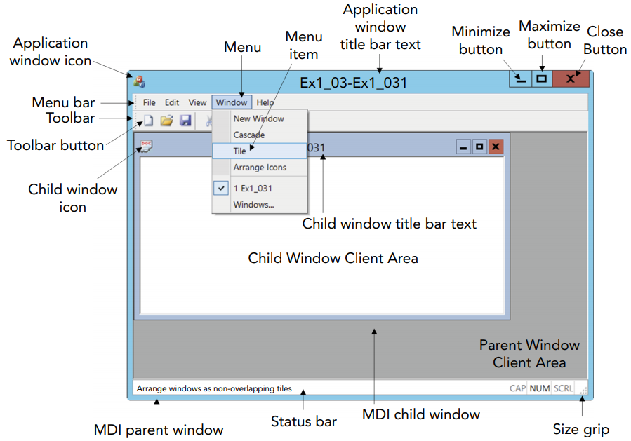

> [微软文档 - Windows 平台 C++ 语言开发应用程序](https://docs.microsoft.com/en-us/cpp/windows/overview-of-windows-programming-in-cpp)
>
> [Ivor Horton's Beginning Visual C++ 2013 by Ivor Horton](https://www.oreilly.com/library/view/ivor-hortons-beginning/9781118845776/)
>
> MFC_类库中文手册.chm

Visual C++ 是微软的 C/C++ 开发环境，使用 Visual Studio IDE，通过 Windows 操作系统 API（Win32 API）可以开发程序，开发 Windows 平台的桌面应用程序。

# Windows概念

*  win32 API 的主要设置用于开发32位或64位应用程序（虽然都叫 Win32 API）。
*  [solution 与 project](https://docs.microsoft.com/en-us/visualstudio/ide/solutions-and-projects-in-visual-studio) 的区别为：一个 solution 可以包含一个或多个 project。
*  handle，句柄。
*  API 后缀 `W` / 后缀 `A` / 无后缀，表示 双字节字符/ 单字节字符 / 当前字符环境的字节字符。

常见类型。

* `LPCSTR` ：
* ` LPCWSTR ` ： Unicode 编码字符串的32位指针。

# Visual Studio

> 参考
>
> [Visual Studio IDE documentation](https://docs.microsoft.com/en-us/visualstudio/ide)

Visual Studio 是微软的 IDE 。

## Create 创建

## Option 选项

* ~~启用 `{}` 作用域符号折叠功能：Tool/Option/Text Editor/CC++/Setting，勾选 Word Wrap 。~~
* 

## Debug 调试

> **参考**
>
> [Visual Studio debugger documentation](https://docs.microsoft.com/en-us/visualstudio/debugger/?view)
>
> [Microsoft - How to: Debug a Release Build](https://docs.microsoft.com/en-us/cpp/build/how-to-debug-a-release-build) 
>
> [Use breakpoints in the Visual Studio debugger](https://docs.microsoft.com/en-us/visualstudio/debugger/using-breakpoints)
>
> [11个强大的Visual Studio调试小技巧](https://jingyan.baidu.com/article/77b8dc7f225b466174eab604.html)

调试用于发现程序中的错误。在菜单栏的 `Debug` 菜单，提供了调试所需的工具。灵活使用**断点**、**跟踪点**等方式调试，代使用**打印日志语句**方式调试，可令代码大幅简洁。

### 调试模式 —— Debug Vs Release

**Debug**，调试版本，包含调试信息，并且不作任何编译优化，供开发者调试；**Release**，发布版本，进行了各种编译优化，使得程序在代码大小和运行速度上都是最优的，发布给用户使用。同时要注意 Debug 版获取的时间、容量开销等测试数据可能与 Release 版差距较大，尤其是需反复迭代计算的程序。二者区别包括：

* **ASSERT()**：从其宏定义可知：debug 版编译 Assert；release 版不编译 Assert。Assert 用于断言某些使程序能继续运行的条件，防止程序走向大崩溃。
* **数组越界**：release 版数组越界不易察觉；debug 版反之。
* **变量初始化**： debug 版初始化成 `0xcc` 是因为 `0xcc` 在 x86 平台是一条 `int 3` 单步中断指令，这样程序如果跑飞了遇到 `0xcc` 就会停下来，这和单片机编程时一般将没用的代码空间填入`jmp 0000`语句是一样 。编程时尤其是指针和数组要做好初始化。

### 使用断点（breakpoints ）暂停语句的运行

代码左栏红点表示放置断点，程序运行到此处，在断点语句**前**暂停：

* 鼠标悬停在上下文变量处，可**查看或修改变量的值**。如果变量是类或结构体，展开后，查看或修改成员的值。
* 如果查看的变量是指针，可以将指针的值输入 Memory 窗口，**查看或修改此刻位于此内存地址值**。
* 在 Call Stack 窗口，可以看到此刻**函数调用栈**。
* 可以**拖动箭头**到某行，强制下一步执行此处。
* 新建**Data Breakpoint**，若监控的上下文数据发生变化则暂停。需提供数据起始地址和数据长度。数据地址可以是：地址值、指针变量、对变量取地址。
* 在 `Debug->Watch` 窗口，观察变量。
* 三种步进方式
  * Sept

对于放置了断点的某行：

* **条件触发**此断点：右键设置断点的 `Condition` ，可设置以下条件：①依据某表达式真/假而触发；②依据某变量值发生改变而触发。
* **条件过滤**此断点：右键设置断点的 `Filter`
* **触发计数**：
* 设置**触发操作**：

* **Data breakpoints** ：在内存地址的值改变时才执行，反之。

### 使用跟踪点（Trace point ）追踪变量值

> **参考**
>
> [Sagar - Tracepoints: Debug with less clutter](https://devblogs.microsoft.com/visualstudio/tracepoints/)
>
> [Log info to the Output window using tracepoints in Visual Studio](https://docs.microsoft.com/en-us/visualstudio/debugger/using-tracepoints)

* 

### 其他调式方法

> 在 Debug 模式下，输出信息到 Console：
>
> 1. 添加  Console Input/Output 头文件：
>
>    ```c++
>    #include "conio.h"
>    ```
>
> 2. 在函数开始运行处分配一个 console：
>
>    ```c++
>    #ifdef _DEBUG
>    	AllocConsole();
>    #endif
>    ```
>
> 3. 随后就可以输出到控制台
>
>    ```c++
>    _cprintf("Log: Some Debug value: %d", var1);
>    ```

# MFC

> **参考链接**
>
> [微软文档  - MFC 桌面应用程序](https://docs.microsoft.com/en-us/cpp/mfc/mfc-desktop-applications)

MFC，Microsoft Foundation Classes，微软基础类库，封装了 Win32 API 等功能，可以开发的具有用户界面的高级程序。

## 桌面程序概念

## 命名规则

在 Windows 开发环境下

## 创建项目


## MFC 工程组成

* **Source** ：源代码，
* **Source** ：源代码，由 `.cpp` 组成。
* **Resource** ：资源，由 `.rs` 和 `.rs2` 组成，用。在 Resource View  窗口下可进行可视化UI设计。

## MFC Class Wizard

[MFC Class Wizard](https://docs.microsoft.com/en-us/cpp/mfc/reference/mfc-class-wizard) 工具用于对代码自动增/查/删/改类、消息映射、成员变量、成员函数等，免去了手动编写过程。

## 消息响应模型

* Windows 程序是**事件驱动（Event Driven）**的，**鼠标点击/键盘输入/窗口大小调整**等都是事件。
* **事件**被记录为**消息** （Massage），是 `int` 类型，通过宏定义使字面上易于区分。消息包括了自带的**系统消息**和开发者定义的**应用程序消息**，如 `WinUser.h` 中的 `#define WM_LBUTTONDBLCLK 0x0203 ` 定义了鼠标左键点击事件。

## 库构成

根据[MFC层级图](https://docs.microsoft.com/en-us/cpp/mfc/hierarchy-chart)，常用的几个类：

[CObject](https://docs.microsoft.com/en-us/cpp/mfc/reference/cobject-class) 对象类，
┣ 
┣ 
┃
┣
┃
┃
┃ 
┗ [CWnd](https://docs.microsoft.com/en-us/cpp/mfc/reference/cwnd-class) 窗口类
	┃ 
	┃
	┣ [Cbutton](https://docs.microsoft.com/en-us/cpp/mfc/reference/cbutton-class) 按钮类，
	┣ CProgressCtrl 进度条类，
	┣ ComboBox 下拉框类，
	┃
	┗ [CDialog](https://docs.microsoft.com/en-us/cpp/mfc/reference/cdialog-class) 对话框类

## 界面

MFC 创建的 Windows 的应用程序的窗口组成如下：



## 菜单栏

menu

## 对话框

Dialog 的两种显示：

* 模态（禁用 Parent Dialog 的操作），调用 `DoModel()` 。
* 非模态（允许父对话框的操作）。

## 控件

button、

* 添加事件处理：

* 添加控件变量：
  
* 在 Resource View 右键某
  
* 常用控件
  
  * Rich Edit
  
  1. Rich Edit，富文本编辑器，可以显示**自定义颜色/字体/大小等**的富文本的控件。
  2. 在 `CApp` 类的工程 `CXXXApp` 派生类的 `BOOL CXXXApp::InitInstance()` 中，加入 `AfxInitRichEdit();`，初始化富文本编辑器。

## 实例

### 设计可调整大小窗口

在限定范围内可调整窗口大小并约束内部控件位置

1. 使能对话框的调整功能。在 Resource View 中选此对话框，选 `Properties` 的 `Border` 为 `Resizing` 。

2. 在 Resource View 中选此对话框，在 `Message` 添加：

   1. `WM_SIZE`，调整对话框后，调用基类的 [`CWnd::OnSize(...)`](https://docs.microsoft.com/en-us/cpp/mfc/reference/cwnd-class?view=vs-2019#onsize)。重写此函数处理对话框被大小调整。要约束内部控件的位置和大小，使用 `this->GetDlgItem(...)->MoveWindow(...)` 。注意对话框首次创建时也会调用，此时对话框还不是窗口，使用 `this->IsWindowVisible()` 做判断。首次约束窗口应写在 `OnInitDialog()` 内。
   2. `WM_GETMINMAXI`，调整窗口后，调用基类的 [`CWnd::OnGetMinMaxInfo(...)`](https://docs.microsoft.com/en-us/cpp/mfc/reference/cwnd-class?view=vs-2019#ongetminmaxinfo)。重写此函数处理`tagMINMAXINFO` 指针，设置最大和最小

### 拖放文件到对话框并访问

1. 在 Resource View 中选此对话框，选 `Properties` 的 `Accept Files` 为 `True` 。
2. 在 Resource View 中选此对话框，在 `Message` 添加 

## 打包资源文件

要在，可通过打包 Dialog 等资源文件实现。

# Windows API

所有主要的 Windows 函数都在 Windows.h 头文件中进行了声明。

## 消息弹窗

调用 [MessageBox](https://docs.microsoft.com/en-us/windows/win32/api/winuser/nf-winuser-messagebox) 函数，会显示一个模态对话框，其中包含一个系统图标、 一组按钮、一个简短的。函数返回一个整数值，该值指示用户单击了哪个按钮。

## 访问 ini 文件

调用 [GetPrivateProfileString](https://docs.microsoft.com/en-us/windows/win32/api/winbase/nf-winbase-getprivateprofilestring) 获取字符串，

 `.ini` 文件内由 sector、key、value 组成。 


函数的 _W 与 _A 后缀——字符处理

参考：[Unicode in the Windows API](https://docs.microsoft.com/zh-cn/windows/win32/intl/unicode-in-the-windows-api)

在使用例如 MFC 库函数 ModifyMenu(...) 时，在 Visual Studio 自动代码补全里提示没有 ModifyMenu(...) 这个函数，而是 ModifyMenuW(...) 这个函数。

Windows API函数对字符处理有3种格式：

1、Windows 一般代码格式(Windows code page)，用A来指代ANSI。 

2、Unicode 格式，用W来指代宽字符(Wide)。

3、以上两种混合体。

以ModifyMenu(...)函数为例，其宏定义如下：

 

\#ifdef UNICODE
 \#define ModifyMenu ModifyMenuW
 \#else
 \#define ModifyMenu ModifyMenuA
 \#endif // !UNICODE

 

如上代码段即可知，若是定义了UNICODE则在函数末尾添加W，若是没有定义，则添加A。

## 常用

# 库

[库](https://en.wikipedia.org/wiki/Library_(computing))是用于开发软件的子程序集合，不是独立程序，向其他程序（如：可执行程序）提供服务的代码。

## 静态库

[静态库](https://docs.microsoft.com/en-us/cpp/build/walkthrough-creating-and-using-a-static-library-cpp?view=vs-2019)有两种：未编译的源代码，源代码有助于 debug，可编译为不同目标平台的二进制文件；预编译的二进制文件，方便快速直接调用。

步骤为：

1. 使用 Visual Studio 新建 C++、windows 的 Static Library Project。
2. 对 project 添加 .h 文件，编写给外部调用的接口，如类声明。对工程添加 .cpp 文件，编写类定义。编译 solution。
3. 创建
4. 调用静态库需要：`.h` 头文件路径，`.lib` 静态库路径。
5. 运行应用程序。

## 动态库

动态调用使用的 Windows API 函数主要有 3 个， 分别是 LoadLibrary、 GetProcAddress 和 FreeLibrary。


# 并行程序

[使用 C++ 和 MFC 进行多线程编程](https://docs.microsoft.com/zh-cn/cpp/parallel/multithreading-with-cpp-and-mfc?view=vs-2019)

简单的任务可直接使用 [CWinThread](https://docs.microsoft.com/en-us/cpp/mfc/reference/cwinthread-class) 类，若需求复杂，则自行设计 `CWinThread` 的派生类。